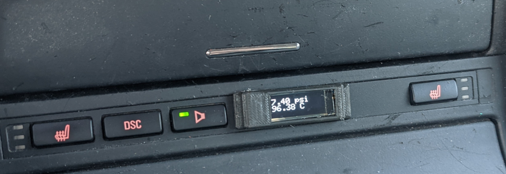
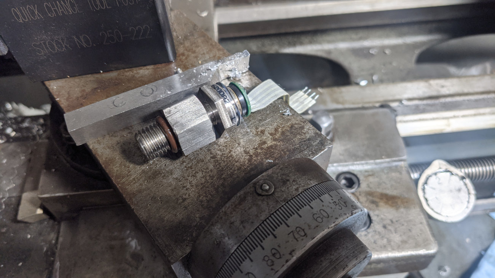
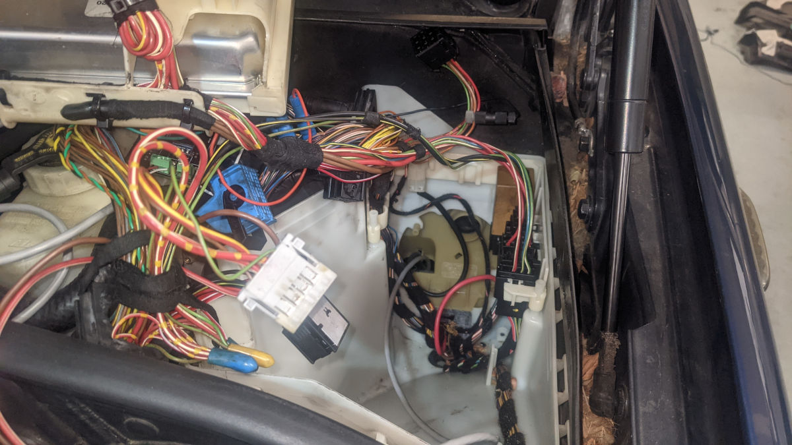
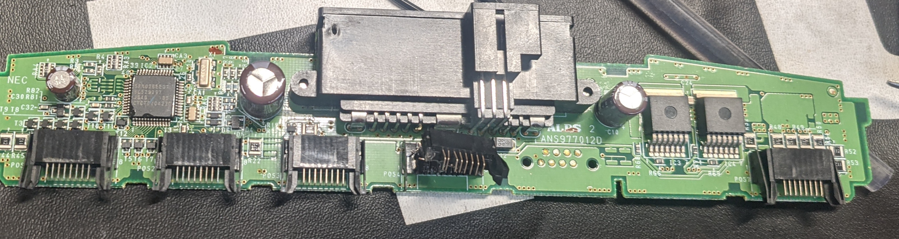

# BMW e46 pressure sensor
Boards and code for adding a pressure sensor to a BMW e46

This project adds a pressure and engine tempature readout to a BMW e46. 

# Desired install
This is the goal of the project:

The display reads out the current pressure from the installed pressure sensor, and reads \
out the engine temperature read from the CAN bus.

# Why read the temperature? 

# Board design
Find the board files [Here](board/i2c-pressure-sensor-driver)

The PCB uses the following components:
- [Teensy 4.0](https://www.pjrc.com/store/teensy40.html)
- [I2C Pressure sensor](https://www.newark.com/amphenol-advanced-sensors/npi-19m-200g2/pressure-sensor-200psi-gauge-i2c/dp/70AJ5206)
- [CAN bus tranciever](https://www.mouser.com/ProductDetail/579-MCP2562FD-E-SN)
- [wire attachment headers 4 pin](https://www.mouser.com/ProductDetail/571-1546215-4)
- [wire attachment headers 3 pin](https://www.mouser.com/ProductDetail/TE-Connectivity/282834-3?qs=A%252Bip%252BNCYi6M69kAjqV38yA%3D%3D)
- [Inexpensive "OLED" displays](https://www.amazon.com/gp/product/B08ZY4YBHL)
- [Inexpensive Amazon 3.3v relay](https://www.amazon.com/gp/product/B09P1DS8RN)
- [Shielded wire to carry the I2C](https://www.mouser.com/ProductDetail/602-M4473-100-09)

## Why an I2C pressure sensor? 

I was getting tired of dealing with analog output sensors that I was using in a different project.
So, I bought the I2C digital output sensor. It turned out to be really easy to read from.

The bad: The manufacturer lists the tread as having a M12 x 1.5 thread on it. That would be great, because that is what the sensor port on the e46 is. The problem is that these sensors actually ship with a M12 x 1.0 thread on it. 

So, I had to make an adapter for this sensor. I made it by buying one of these: [m12 to NPT adapter](https://www.amazon.com/gp/product/B08DG6YQM1)
I then threw the thing in my lathe, and cut off everything at the NPT hole and back. 
After that I bought a tap[m12 x 1.0 tap](https://www.amazon.com/gp/product/B07Z1WJ6XR)

I had to drill out the internal cavity just a bit, then I taped it and mounted the pressure sensor in the hole. Using teflon tape, and a Niton o-ring to make a seal. 

This is the result of the adapter:

## Board design

I had to rev the board once as I originally powered the 3.3v regulator off of the 12V rail, and that meant that nothing on the board got power when it wasn't plugged into an external voltage source. After moving the 3v3 regulator input to the 5V rail fixed that issue. 

I felt it was a bad idea to connect the teensy 3.3v rail to the main board 3.3v rail as that could mean that the teensy 3.3v regulator could get over currented if the relay came on when plugged into a USB connection. 

## Manufacturing the board

This time I used pcbway. They seem to have an amazing deal of $25 for a 5 boards in a 24 hour turn from China. Shipping takes a additional 5 busniess days though.

# Install

## pressure sensor install

- Start by removing the airbox
- That should give you access to the oil pressure switch, unplug it
- Unscrew the factory pressure switch
- Screw in the new pressure sensor (Perhaps with the adapter). Ideally you installed a connector in the cable unlike the way I did.
- Make some notches in the wire grommetsgoing to the DME to make room for the sensor cable

## Wire install to display

If you remove the DME completly you get access to a firewall passthrough hole in the e46, shown

Run about a meter of cable into the cabin

Pull the plastic cover off of the driver side footwell, to feed the wire through

Run the wire to the center console

You can pull on the shift boot to get at some screws to remove the center console panel

## Display mounting

I first drilled a hole in the button console where I wanted the display. Don't do that. 

Remove the button console completly from the car. 

Open the plastic, and remove the board.

Drill a hole only where you do not interfear with one of the optional buttons

You can see that I ended up breaking a connector on my board. This is okay because my car doesn't have a button in that spot

# Refernces:
- [e46 CAN bus project](https://www.bimmerforums.com/forum/showthread.php?1887229-E46-Can-bus-project)
- [ms43 DME pinout](https://www.adamomotorsport.pl/pinout-m54)
- [ms45.1 DME pinout](https://www.ms4x.net/index.php?title=Siemens_MS45_Pinout)
- [useful BMW CAN bus help](https://wiki.autosportlabs.com/BMW_E46_CAN)
